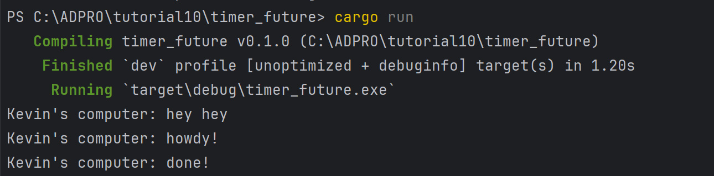
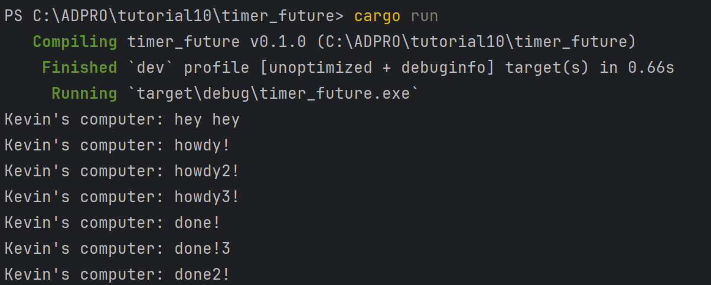
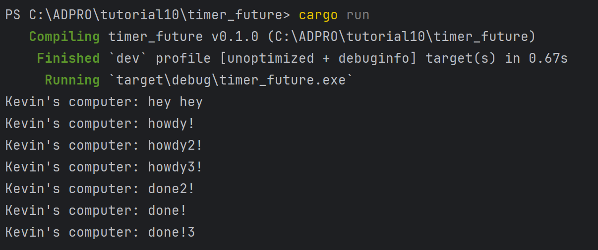

# TUTORIAL 10 (TIMER)

**Name:** Theodore Kevin Himawan

**NPM:** 2306210973

**Class:** ADPRO A

## Reflection 1.2
>Take a look at what happened. Capture the result of your execution. Put it in your Readme.md,
with some explanation why the result is as such.

In the program, the new print command (Kevin's computer: hey hey) is executed first even though it is put below the first two lines (howdy! & done!). This is because the new print command is written outside of the async block, which means it does not have to be spawned and queued first. The first 2 lines are only ran when the program reaches <code>executor.run()</code>.

## Reflection 1.3
>Try to remove and put it again. Pay attention to your console. Capture your screen as many as
needed (but not more than three) and provide explanation why it is like that. Put in in Readme.md

### With `drop(spawner)`

### Without `drop(spawner)`

When <code>drop(spawner)</code> is commented, the program keeps on running because the program runs the executor again and again, without knowing when to stop. The program runs "Kevin's computer: hey hey" first and then moves on to the queue, which would print out howdy, howdy2, and howdy3. Then, the done, done2, and done3 will be printed out randomly due to using <code>TimerFuture</code>.
